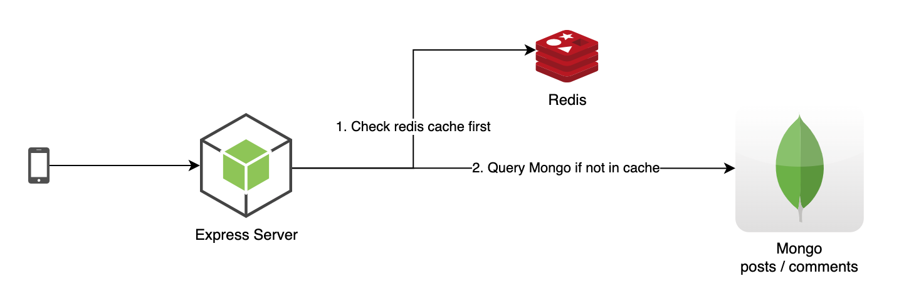

# Description
This is a simple Post/Comment REST service that allows users to perform CRUD operations on posts and comments. This is a Node service running Express, with mongo as the data base and redis as the cache.

# Assumptions: 
This service is behind a WAF and a proxy that handles authentication and rate limiting 

# TODO:
Improvments that can be added to the project:
- convert the project to type script
- add more tests 
- add test coverge report
- add staging and prod config.json files
- implement better caching strategy
- add linter 
- add logging to data dog or somethign similar
- add jenkins file 
- when deleting a post, delete all comments as well

Tonight:
- DONE check service endpoints 
- check docker 
- remove console logs 
- DONE add more end to end tests
- DONE move service and app out or src 

# Diagram 

# Swagger
This service will automatically start a swagger server when started.  
[http://localhost:8080/api-docs/#/](http://localhost:8080/api-docs/#/)

# Running locally 
The service can be run locally with out docker for faster development.

### MongoDB Requirments: 
- [mongoDB docker image](https://hub.docker.com/_/mongo) running on the default port `27017`
- mongoDB Data Base name `efuseMongo`

### Redis Requirments:
- [redis docker image](https://hub.docker.com/_/redis) running on the default port `6379`
- no name required

### Service Start: 
    
    node src/Routes/server.mjs

# Running with docker-compose 
### Docker Start: 

    NODE_ENV=wip docker-compose up

# Tests
End to end tests will automatically spin up an in-memory-mongodb and in-memory-redis-cache. Tests can be run using:
    
    npm test
